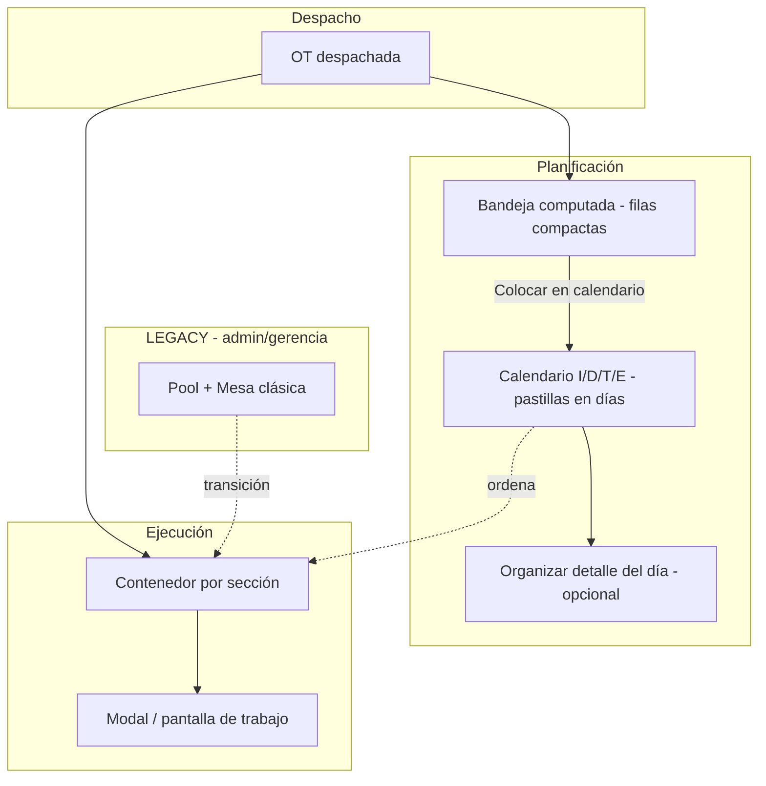

# Bloque 11 — Calendario, bandeja, contenedor y mesa (decisión de diseño)

> **Fecha:** 21 ago 2026 · **Rev. completa:** **26 ago 2026 noche** (diseño + contenedor + bandeja + **spike detalle-día §6.5 B**)
> **Estado:** diseño **cerrado** · contenedor/bandeja **smoke OK** · **detalle-día B + fase 3 v2 + PDF §25** · merge `main` pendiente OK Manel
> **Complementa:** `MINERVA_BLOQUE11_CALENDARIO_MAESTRO_LANZAMIENTO.md` · `.MANUALES/MINERVA_BLOQUE11_ANALISIS_CONTENEDOR_VS_MESA.md` · `.MANUALES/MINERVA_BLOQUE11_BRIEF_JORDI_CARLOS.md`
> **Código:** bandeja §5/§23 · contenedor CTP→…→I/D · hecho visual 26 ago · spike §6.5 → `SESION_26AGO2026_BLOQUE11_SPIKE_DETALLE_DIA.md`

---

## 0. Veredicto ejecutivo

| Tema | Decisión |
|------|----------|
| **Sustituir Optimus** | Despacho ≈ launch; operario tira del **contenedor** (pull) |
| **Calendario I/D/T/E** | **Planning visual** del responsable — Carlos ya lo usa como mesa real |
| **Bandeja izquierda** | **Computada** (sin filas auto en BD al despachar); sustituye hojas Optimus / Excel |
| **Contenedor** | Lista por sección desde pasos `disponible`; **desacoplar** de `prod_mesa_ejecuciones` |
| **Mesa (repensada)** | **No ejecuta.** «Organizar detalle del día» — archivos **nuevos**; LEGACY intacto |
| **PR1 «Enviar a cola»** | **Retirado del calendario** (22 ago). Rama/lib aparcados para LEGACY |
| **Retener OT** | Excepción válida (diseño); **no construir** hasta que lo pidan |
| **Piloto contenedor** | CTP + Troquelado |
| **Piloto planning** | Bandeja + calendario con **Carlos**; detalle del día cuando quite Excel |

**Frase enseñable (Jordi/Carlos):**

> Despacho pone la OT en el circuito (como Optimus). El contenedor muestra todo lo que el itinerario deja hacer en cada sección. Carlos, Antonio y Gabri usan el calendario para ordenar el día. En offset (cuello de botella) se mantiene secuencia fina (turnos/horas) **encima** del contenedor — no la mesa LEGACY como puerta de ejecución.

*(Frase para planta alineada con el brief Jordi/Carlos — incluye matiz offset.)*

---

## 1. Evidencia de campo (no hipótesis)

Observaciones **22 ago 2026**:

- Carlos lleva **semanas** con el calendario Minerva en la **segunda pantalla**.
- Gemma (CTP) usa **listado/PDF del calendario** impreso como guía.
- Carlos planifica en Minerva y **copia a Excel** el listado del día → faena doble que bandeja + detalle del día deben eliminar.

**Implicación:** la pregunta ya no es «¿adoptarán el calendario?». Es «¿cómo quitamos Excel, Pool y mesa como puertas obligatorias?».

---

## 2. Mapa conceptual



> **§11:** este diagrama es **mapa conceptual**, no plan de trabajo secuencial.

---

## 3. Tres capas + regla de oro

| Capa | Pregunta | Fuente de verdad | Quién mueve |
|------|----------|------------------|-------------|
| **Calendario** | ¿Cuándo **quiero** que se haga? ¿Orden del día? | `prod_calendario_produccion_ot` | Carlos, Rita, Antonio, Gabri |
| **Itinerario** | ¿Qué **se puede** hacer ahora? | `prod_ot_pasos.estado` | Sistema (trigger) |
| **Contenedor** | ¿Qué ve y hace el operario? | Hoy: `prod_mesa_ejecuciones` → **destino:** pasos `disponible` | Operario |

> **El calendario ORDENA. El itinerario AUTORIZA.**

### Dos ejes independientes (Bloque 9)

| Eje | Fuente | Pregunta |
|-----|--------|----------|
| **Disponible** | `prod_ot_pasos.estado` | ¿Paso anterior hecho? |
| **Ejecutable** | Consulta viva compra/stock/cartela | ¿Hay material? |

**No** almacenar `esperando_material` en BD. UI: por defecto **solo ejecutable**; toggle «ver todo».

---

## 4. Dos tipos de proceso

### 4.1 Calendario — ámbitos I / D / T / E

| Ámbito | Responsable | Rol |
|--------|-------------|-----|
| **I** Impresión offset | Carlos (+ Jordi) | Planning principal |
| **D** Digital | Rita | Igual en su ámbito |
| **T** Troquelado | Antonio | Orden del día + previsión |
| **E** Engomado | Gabri | Orden del día + previsión |

Una OT puede tener **pastillas en varios ámbitos y fechas** (estela: I hecha día 5, T planificada día 8, E día 10). **No** auto-mover al día siguiente; queda **vencida visible**; el responsable mueve manualmente.

### 4.2 Contenedor puro — sin calendario propio

| Proceso | Notas |
|---------|--------|
| **CTP** | Orden heredado de I de Carlos o fallback entrega |
| **Guillotina** | Contenedor; Miguel tira de lista |
| **Desbroce** | Área engomado; Gabri ordena vía E / contenedor |
| **Manipulados internos** | Contenedor |
| **Externos (Ramón)** | Módulo actual; pastilla refleja «externo» mientras dure |

---

## 5. Bandeja computada (panel izquierdo)

Sustituye **hojas HR de Optimus** en la mesa de Carlos.

| Aspecto | Decisión |
|---------|----------|
| **UI** | Filas compactas (1 por OT); pastillas solo en calendario con día |
| **Toggle** | «Ocultar panel» / «Mostrar panel» (patrón IDE/Edge) |
| **Interacción** | **Sin drag** desde bandeja. «Colocar en calendario…» o flujo actual |
| **Datos** | **Query computada** — no auto-insert al despachar (`fecha` obligatoria en BD) |
| **Al colocar** | Desaparece de bandeja (para ese ámbito) |

### Filtro por defecto — cadena de **visualización**

⚠️ **No** confundir con cadena de **autorización** (§3). Solo ordena qué se ve primero. Toggle «ver todas».

| Responsable | Bandeja por defecto |
|-------------|---------------------|
| **Carlos (I)** | Despachadas con impresión, **sin pastilla I** |
| **Rita (D)** | Análogo digital |
| **Antonio (T)** | Con troquel sin pastilla T, **I colocada o hecha** |
| **Gabri (E)** | Con engomado sin pastilla E, **T colocada o hecha** |

**Overlay calendarios** (tipo Outlook): Antonio/Gabri ven I de Carlos mientras planifican T/E.

---

## 6. «Organizar detalle del día» (mesa repensada)

### 6.1 Qué muere en el camino feliz

- Mesa como **puerta** a ejecución (`launchExecution`).
- Mesa **semanal** (calendario la sustituye).
- Pool como paso obligatorio.

### 6.2 Qué es la pantalla nueva

Flujo desde calendario (día X + ámbito) → botón **«Organizar detalle del día»**:

```
┌─────────────────────────────────────────────────────┐
│ Izquierda: OTs de ESE día (del calendario)          │
│ Derecha: columnas máquina × turno (drag, horas)     │
│ Navegar día ±1 · sábado · PDF · cálculo horas       │
│ NO lanza ejecución                                  │
└─────────────────────────────────────────────────────┘
         ↓
Contenedor refleja orden (operario)
```

**Composición del día (v1):** añadir/quitar/mover OTs entre días = **calendario**. Detalle = **solo orden fino** por máquina/turno. Atajos desde detalle = fase posterior si lo piden.

**Piloto:** solo **Carlos** (offset, 1 máquina → orden 1-2-3). Si quita Excel, extender a Antonio/Gabri.

### 6.3 LEGACY vs archivos nuevos

| LEGACY (sin tocar, tab admin/gerencia) | Nuevo (implementar) |
|----------------------------------------|---------------------|
| `planificacion-pool-ots-tab-v2.tsx` | Bandeja en calendario |
| `planificacion-mesa-diaria-tab.tsx` | `planificacion-detalle-dia-tab.tsx` (nombre orientativo) |
| `planificacion-mesa-secuenciacion-tab.tsx` | No replicar semanal |
| `planificacion-pasar-a-mesa.ts` | Solo LEGACY |

**Reutilizar libs:** `planificacion-mesa-diaria.ts`, `types/planificacion-mesa.ts`, lógica horas/turnos/sábado/PDF donde aplique.

**Diferencias clave vs mesa actual:**

| Mesa LEGACY | Detalle del día |
|-------------|-----------------|
| OTs desde Pool (`enviada_mesa`) | OTs desde **calendario del día** |
| `launchExecution` obligatorio | **No ejecuta** |
| Semanal + diaria | Solo **día** (+ navegar ±1) |

Persistencia del orden por máquina: **cerrada → opción B** — ver §6.5 (26 ago).

### 6.4 Offset (cuello de botella)

**Regla:** offset **también** entra al contenedor (mismo motor que CTP/troquel). No es excepción al `launchExecution` LEGACY en el camino feliz.

Lo específico de offset es la **secuencia fina del día** (turnos, horas, PDF) vía «Organizar detalle del día» — **encima** del contenedor, **sin** ser puerta previa a ejecutar. Criterio Drum-Buffer-Rope: más detalle de planificación donde limita el flujo; no un circuito distinto de ejecución.

| Pregunta típica planta | Respuesta |
|------------------------|-----------|
| «¿En offset no cambia nada?» | Cambia el circuito (contenedor); **no** pierde turnos/horas/PDF (detalle del día). |
| «¿Seguimos lanzando desde mesa?» | **No** en camino feliz. LEGACY solo admin/gerencia en transición. |

### 6.5 Spike persistencia detalle del día — **CERRADO 26 ago (opción B)**

**Decisión:** tabla ligera nueva. **No** reutilizar `prod_mesa_planificacion_trabajos`.

Sesión: `SESION_26AGO2026_BLOQUE11_SPIKE_DETALLE_DIA.md` · migración: `supabase/migrations/20260826200000_prod_calendario_detalle_dia.sql` (**aplicada** en Supabase 26 ago).

#### Por qué B (no A)

1. **LEGACY vivo + separación por rol** (admin/gerencia): aislar por tabla permite RLS limpia; misma tabla obligaría a discriminar por columna/`origen`.
2. **Dos escritores = bugs de legado** (patrón Bloque 9): Pool/`launchExecution` vs calendario/detalle no deben compartir filas.
3. **Due diligence coexistencia** (si se reutilizara la misma tabla):
   - Índice único `ux_mesa_ot_activa` (OT + máquina, estados borrador/confirmado/en_ejecucion) → **conflicto** si Pool y detalle-día tienen la misma OT.
   - `prod_mesa_ejecuciones.mesa_trabajo_id` + trigger `trg_prod_mesa_ejecuciones_itinerario_finaliza` cierra `estado_mesa` al finalizar → asume circuito de mesa.
   - Contenedor ya inserta ejecuciones con `mesa_trabajo_id = null` (camino feliz sin mesa).
   - `calendario-mesa-espejo.ts` leería filas detalle como «en mesa» y mentiría al planificador.
   - `origen_pool_id`, `estado_mesa` (borrador→…→finalizada) = semántica Pool, no planning puro.

Conclusión: A es peligroso aunque ahorre una migración hoy.

#### Diagrama origen de datos (camino feliz)

```
prod_calendario_produccion_ot     ← qué OT está en qué día (ámbito I/D/T/E)
         │
         │ 1:1 / 1:N fino
         ▼
prod_calendario_detalle_dia       ← orden fino: máquina × turno × slot × horas
         │                            (NO ejecuta, NO launchExecution)
         │ lectura orden
         ▼
Contenedor / OTs ejecución        ← grupo «Hoy» = disponible ∩ planificado hoy
                                    grupo «Cola» = disponible sin plan hoy
                                    Itinerario autoriza; detalle solo prioriza
```

LEGACY (aislado): `prod_planificacion_pool` → `prod_mesa_planificacion_trabajos` → `prod_mesa_ejecuciones.mesa_trabajo_id` — **sin escritura** desde detalle-día.

#### Modelo tabla ligera (fase 3)

Nombre: `prod_calendario_detalle_dia` — **sin columna `fecha`** (siempre join a pastilla; mover día = UPDATE id → no pierde orden).

| Columna | Tipo | Notas |
|---------|------|--------|
| `id` | uuid PK | |
| `calendario_ot_id` | uuid FK → `prod_calendario_produccion_ot` **ON DELETE CASCADE** | Quitar pastilla = limpia slot |
| `ambito` | text | mismo check I/D/T/E |
| `ot_numero` | text | |
| `maquina_id` | uuid NULL → `prod_maquinas` | Piloto Carlos: SpeedMaster |
| `turno` | text NULL | `manana` \| `tarde` |
| `slot_orden` | int > 0 | Orden en columna |
| `horas_planificadas_snapshot` | numeric NULL | |
| `notas` | text NULL | |
| `created_by` / `created_at` / `updated_at` | | |

Unique: `(calendario_ot_id)`. Índice: `(ambito, maquina_id, turno, slot_orden)`.

**Planes atrasados (fase 3+):** vista mes/semana ya acota; «Solo pendientes» no limpia por fecha. **✅ 27 ago:** botón «Atrasadas (N)» + modal central (`collectEntradasAtrasadas` · §27). No auto-mueven. Backlog opcional: filtro N días.
#### Huérfanas / plan que no se cumple

| Caso | Qué hacer |
|------|-----------|
| Quitar/mover pastilla del calendario | **CASCADE** borra el slot (no fantasmas) |
| Día pasado, OT nunca `disponible` (STOP material, etc.) | Slot **permanece** mientras la pastilla exista (Carlos ve que el plan se rompió). Al borrar pastilla o mover día → CASCADE |
| Retención | Job/UI opcional: avisar pastillas con `fecha < hoy` y semáforo no hecho; no auto-borrar sin acción humana en v1 |

#### Impacto `planificacion-detalle-dia-tab.tsx` (fase 3)

- **Lee** OTs del día desde `prod_calendario_produccion_ot` (no Pool).
- **Escribe** orden/máquina/turno/horas solo en `prod_calendario_detalle_dia`.
- **Reutiliza** UI/libs de mesa (`planificacion-mesa-diaria.ts`, PDF, turnos) donde encaje — **sin** `launchExecution` ni writes a `prod_mesa_planificacion_trabajos`.
- Entrada: botón calendario «Organizar detalle del día» (día + ámbito). Ruta/tab técnica OK; **no** bautizar menú «Planificador» ni orden definitivo de pestañas → **Bloque 12**.
- LEGACY: aislamiento por rol (§10) = valla de seguridad **✅ 27 ago** (`planificacion-legacy-access.ts` · §27). Nombres/orden menú feliz → Bloque 12.

#### Lista ejecución — 2 grupos visuales (diseño cerrado)

| Grupo | Criterio | Orden |
|-------|----------|--------|
| **Hoy (planificado)** | Pastilla/detalle hoy **y** paso `disponible` (o en curso) | `slot_orden` del detalle |
| **Disponibles sin plan** | Paso listo, sin plan hoy | Fecha entrega |

Regla: **calendario/detalle ordenan; itinerario autoriza.** Estar en «Hoy» ≠ ejecutable si falta paso/material. No ocultar planificadas no ejecutables del día en el detalle de Carlos; en contenedor, no accionables o fuera del grupo activo según semáforo.

#### Semáforo material en calendario/detalle (diseño cerrado)

- **No bloquea** colocar OTs (TEST: 99% sin compra/despacho → no muro ni toasts).
- Icono pequeño (palet/punto); compra en **tooltip**.
- Color = **misma fuente que Pool `materialStatus`** (cartelas/muelle), no el semáforo de Externos-compras.

| Color | Significado |
|-------|-------------|
| **Gris** | Sin despachar / material no aplica aún |
| **Rojo** | Despachada, sin cobertura (Pool rojo) |
| **Ámbar** | Muelle o cartelado parcial (Pool amarillo) |
| **Verde** | Cartelado ≥ objetivo (Pool verde) — **no** «solo recibido» |

I/D: útil (Carlos/Rita). E/T: bajo ruido (aguas arriba suele bastar). Dolor Rita↔Ramón↔Miguel (estado «¿cortado?») = **✅ 27 ago:** Guillotina en contenedor I/D (chip ejecución) + **tooltip** en pastillas calendario (sin chip visible — §27).

---

## 7. Contenedor y ejecución

### Trabajo de verdad (motor)

| ✅ Ya funciona | ❌ Falta |
|---------------|---------|
| Primer paso `disponible` al despachar | Lista operario **sin** mesa obligatoria |
| Trigger avanza itinerario | Claim = **iniciar** |
| `ExecutionCard`, cartelas, gates 9 | Gate material por **proceso** |

### UI ejecución

- Lista fina; **modal grande** o pantalla completa al abrir OT.
- **Orden arreglos:** filtro + orden **antes** que modal.

---

## 8. PR1 — retirada del calendario

| Pieza | Estado |
|-------|--------|
| Label paso, espejo lectura, semáforos, PDF | ✅ Mantener |
| Botón «Enviar a cola de Mesa» | ❌ **Retirado** (22 ago tarde) |
| `planificacion-pasar-a-mesa.ts` | LEGACY / rama feature |
| Rama `feature/bloque11-calendario-enviar-cola-mesa` | Sin merge como arquitectura |

---

## 9. Retener (futuro)

Toggle «Retener / no lanzar aún»: OT despachada excluida del contenedor hasta liberación. **No construir** hasta demanda.

---

## 10. LEGACY

Pestaña **Planificación clásica (Pool / Mesa)** — solo **admin / gerencia** durante transición.

---

## 11. Orden conceptual ≠ orden de construcción

El diagrama §2 **no** implica terminar contenedor antes de bandeja.

| Track A — Motor | Track B — Planning UI |
|-----------------|----------------------|
| Contenedor + ejecución sin mesa | Bandeja + toggle panel |
| Claim al iniciar | Overlay calendarios |
| Filtro ejecutable | Detalle del día (Carlos) |
| Piloto CTP + Troquel | Quitar Excel |

La bandeja **no depende** del contenedor; solo de despacho + itinerario (operativos).

---

## 12. Fases

| Fase | Entregable |
|------|------------|
| **0** | Validar brief Jordi/Carlos |
| **1a** | Contenedor + modal ejecución (CTP + T) |
| **1b** | Bandeja computada + ocultar panel (Carlos) |
| **2** | Filtros cadena bandeja + overlay |
| **2b** | **Spike persistencia detalle del día** (§6.5) — **✅ B 26 ago** |
| **3** | Detalle del día — Carlos (migración + UI) |
| **4** | Offset secuencia fina (refinar detalle si hace falta) |
| **5** | LEGACY tab |

---

## 13. Decisiones cerradas

| # | Decisión |
|---|----------|
| 13.1 | Calendario ordena; itinerario autoriza |
| 13.2 | Bandeja **computada** |
| 13.3 | Filtro cadena = **visualización** |
| 13.4 | CTP/guillotina/desbroce/manipulados = contenedor |
| 13.5 | Solo I/D/T/E en calendario |
| 13.6 | Mesa nueva **no ejecuta**; archivos nuevos; LEGACY intacto |
| 13.7 | Composición día v1 = calendario; detalle = orden fino |
| 13.8 | Claim = iniciar |
| 13.9 | No auto-mover vencidas |
| 13.10 | PR1 botón fuera calendario |
| 13.11 | Retener = diseño, no build |
| 13.12 | Gate por proceso = pendiente |
| 13.13 | Persistencia detalle del día = **opción B** (`prod_calendario_detalle_dia`) — spike 26 ago ✅ |
| 13.14 | PDF detalle-día rico + print en **ventana nueva** (no tumba Electron) — 26 ago ✅ · también mesa diaria LEGACY |

---

## 14. Checklist

- [x] Documentar modelo completo
- [x] Retirar botón «Enviar a cola» del calendario
- [ ] Validar brief Jordi/Carlos — **v2** `.MANUALES/MINERVA_BLOQUE11_BRIEF_JORDI_CARLOS.md` (27 ago); leer **antes del domingo**; respuesta A/B reserva dura
- [x] **Spike bandeja computada** (§5 · smoke planta 23 ago · ver §23)
- [x] **Spike contenedor CTP** (`feature/bloque11-contenedor-ctp-spike`) — ver §17
- [x] **Spike persistencia detalle del día (§6.5) — cerrado 26 ago opción B** · `SESION_26AGO2026_BLOQUE11_SPIKE_DETALLE_DIA.md`
- [x] Ejecución modal (pantalla de trabajo + botones Iniciar/Pausar/Cerrar en línea gorda · 23 ago)
- [x] Spike troquel + claim (`contenedor-troquel.ts` · ver §18)
- [x] Spike contenedores Guillotina/Desbroce/Manipulados + Engomado claim (`contenedor-seccion.ts` · ver §19)
- [x] Spike Contenedor Impresión + Digital (ver §20)
- [x] Detalle del día (Carlos) — fase 3 **UI v2** (26 ago) · PDF rico + fix cierre print · orden «Hoy» por `slot_orden` · **cabeceras Hoy/Disponibles + icono material 27 ago**
- [x] LEGACY tab — aislamiento por rol (valla §10 · `planificacion-legacy-access.ts` · badge LEGACY · 27 ago) — nombres/orden menú feliz → **Bloque 12**
- [x] Contenedor I/D: estado Guillotina («¿cortado?») — chip ejecución + tooltip calendario (27 ago · §27)
- [x] Atrasadas — botón + modal (sustituye cajón banner · `collectEntradasAtrasadas` · 27 ago · §27)
- [x] PDF detalle-día cartelas + material + print Electron transversal (27 ago · `ace0409` · §27)
- [x] Orden «Hoy planificado» mañana antes tarde (`rankPlanHoyByOt` · `5675415`)

---

## 15. Referencias código

| Pieza | Archivo | Notas |
|-------|---------|-------|
| Itinerario | `prod-ot-itinerario-client.ts` | Paso 1 disponible |
| Calendario | `calendario-produccion-page.tsx` | Sin botón cola · + bandeja §23 |
| Bandeja | `calendario-bandeja.ts` · `calendario-bandeja-panel.tsx` | Query + panel §5 |
| Espejo | `calendario-mesa-espejo.ts` | Lectura |
| Pasar a mesa | `planificacion-pasar-a-mesa.ts` | LEGACY |
| Mesa diaria LEGACY | `planificacion-mesa-diaria-tab.tsx` | No modificar camino feliz |
| Detalle día (fase 3) | `calendario-detalle-dia-dialog.tsx` · `calendario-detalle-dia.ts` | Entrada desde modal día · escribe `prod_calendario_detalle_dia` |
| PDF detalle + print seguro | `calendario-detalle-dia-print.ts` | HTML rico · `printHtmlInNewWindow` / `printElementInNewWindow` (§25) |
| Material pastilla | `calendario-material-status.ts` | Pool cartelas/muelle + gris N/A · icono en calendario |
| Lib detalle | `calendario-detalle-dia.ts` | CRUD + join por pastilla (sin fecha duplicada) |
| Tabla detalle | `prod_calendario_detalle_dia` | Migración `20260826200000` **aplicada** 26 ago |
| Helpers mesa | `planificacion-mesa-diaria.ts` | Reutilizar UI avanzada luego; no writes LEGACY |
| Ejecución | `planificacion-ots-ejecucion-tab.tsx` | + contenedor CTP spike · chip Guillotina I/D |
| Contenedor CTP | `contenedor-ctp.ts` | Query + fila ligera |
| Atrasadas | `calendario-produccion.ts` · `calendario-produccion-page.tsx` | `collectEntradasAtrasadas` · modal §27 |
| Guillotina UI | `calendario-produccion-progreso.ts` | `guillotinaStatusFromPasos` · tooltip pastilla · chip ejecución |
| Valla LEGACY | `planificacion-legacy-access.ts` · `planificacion-ots-page.tsx` | Mesa diaria/semanal solo admin/gerencia |
| Orden Hoy | `calendario-detalle-dia.ts` | `rankPlanHoyByOt` — mañana antes tarde |

---

## 16. Resumen una página

1. Carlos **ya usa** el calendario — reforzarlo.
2. **Bandeja computada** quita hojas Optimus y Excel (con detalle del día).
3. **Contenedor** sustituye Pool/Mesa como puerta.
4. **CTP/guillotina/desbroce/manipulados** = contenedor; **I/D/T/E** = calendario.
5. **Detalle del día** = mesa nueva en **archivos nuevos**, no ejecuta; LEGACY vive en `.tsx` actuales.
6. **Construcción en paralelo:** motor + UI planning.
7. **PR1 botón eliminado** del calendario.

---

## 17. Spike CTP — resultado (22 ago 2026 noche)

**Rama:** `feature/bloque11-contenedor-ctp-spike`

### Qué se hizo
- Lista de ejecución mezcla filas reales + **virtuales** del contenedor CTP (pasos `disponible`, OT despachada, sin ejecución activa en ese `ot_paso_id`).
- Badge «Contenedor CTP»; toggles **Mostrar OTs prueba** (off por defecto) y **Solo ejecutable**.
- Al **Iniciar**: `crearEjecucionLigeraCtp` → INSERT `pendiente_inicio` con `mesa_trabajo_id = null` + UPDATE `en_curso` (para disparar triggers de itinerario).
- Calendario Carlos **no tocado**.

### Sorpresas / fricción al desacoplar `prod_mesa_ejecuciones`

| Hallazgo | Impacto |
|----------|---------|
| `maquina_id` es **NOT NULL** | Fila «ligera» exige máquina CTP (`tipo_maquina = preimpresion`, hoy «CTP MNRV»). No se puede omitir. |
| `mesa_trabajo_id` **nullable** | OK — no hace falta hueco de mesa. |
| Unique parcial `(ot_numero, maquina_id)` en estados activos | Deduplicar por paso ocupado **y** no crear segunda activa misma OT+máquina. |
| Triggers itinerario son **AFTER UPDATE**, no INSERT | Insertar directo como `en_curso` **no** pondría el paso en marcha. Solución: INSERT `pendiente_inicio` → UPDATE `en_curso`. |
| CTP no consume papel | «Ejecutable» = siempre true si `disponible`; el toggle queda listo para otras secciones. |

### Smoke manual recomendado
1. Activar «Mostrar OTs prueba» → debe verse p.ej. **98005** (CTP disponible) con badge Contenedor CTP.
2. Desactivar el toggle → 98005 **desaparece** de la lista planta.
3. Con pruebas ON: abrir → Iniciar → debe nacer fila real sin mesa; cerrar paso → itinerario avanza.
4. LEGACY Pool/Mesa: sin cambios.

### Siguiente
~~Troquelado + claim al iniciar (mismo patrón, multi-máquina).~~ → ver §18

---

## 18. Spike Troquel + claim — resultado (22 ago 2026 noche)

**Rama:** `feature/bloque11-contenedor-ctp-spike` (mismo spike CTP + Troquel)

### Qué se hizo
- Lista de ejecución mezcla filas reales + **virtuales Contenedor Troquel** (pasos `disponible`, OT despachada, sin ejecución activa en ese `ot_paso_id`).
- Badge «Contenedor Troquel»; máquina placeholder hasta claim.
- **Claim = Iniciar:** selector de máquinas `tipo_maquina = troquelado` (JR, …). Al iniciar → `crearEjecucionLigeraTroquel` (mesa null + UPDATE `en_curso`).
- Filtro por máquina troquel: filas virtuales siguen visibles (el claim preselecciona esa máquina).
- «Devolver al Pool» oculto en filas virtuales contenedor (CTP y Troquel).
- Calendario Carlos **no tocado**.

### Smoke manual recomendado
1. Activar «Mostrar OTs prueba» → buscar OT con Troquel `disponible` (p.ej. **98010-02**) → badge **Contenedor Troquel** y texto *elegir al iniciar*.
2. Abrir parte → caja ámbar **«Elige troqueladora (claim)»** (sin default ASPAS). Elegir JR → **Iniciar**.
3. Si claimas mal: **Anular (volver a Contenedor)** (no «Devolver al Pool» — eso exige mesa).
4. Cerrar proceso Troquel → itinerario avanza.
5. LEGACY Pool/Mesa: sin cambios.

### Lab 22 ago — 98010-02
- Offset finalizada OK; claim accidental ASPAS; «Devolver al Pool» fallaba sin mesa.
- BD: ejecución ASPAS cancelada → Troquel `disponible` otra vez (estado post-impresión).
- UX fix: claim obligatorio + visible; anular ejecución ligera.

### Siguiente
~~Contenedor Impresión~~ → tras validar §19 (Desbroce/Guillotina/Manipulados/Engomado).

---

## 19. Spike contenedores G/D/M + Engomado (22 ago 2026 noche)

**Rama:** `feature/bloque11-contenedor-ctp-spike`

### Qué se hizo
- Módulo genérico `contenedor-seccion.ts`: Guillotina, Desbroce, Manipulados, Engomado.
- **Guillotina / Desbroce / Manipulados MNRV:** 1 máquina (como CTP). Manipulados = nombre exacto `Manipulados MNRV` (tipo BD `engomado`).
- **Engomado:** claim multi-máquina (engomadora 65/110, KONIKA; excluye Manipulados).
- Badges violeta; Anular ligera sigue valiendo.

### Smoke
1. **98010-02** → Contenedor Desbroce → Iniciar → cerrar → Engomado `disponible`.
2. Engomado → claim engomadora → Iniciar.
3. Guillotina / Manipulados si hay pasos `disponible` en lab.

### Siguiente
~~Contenedor Impresión~~ → ver §20.

---

## 20. Spike Contenedor Impresión + Digital (22 ago 2026 noche)

**Rama:** `feature/bloque11-contenedor-ctp-spike`

### Qué se hizo
- Extiende `contenedor-seccion.ts`:
  - **Impresión Offset** (`proceso_id` 1): máquina SpeedMaster (1 activa) → **sin claim** (como CTP).
  - **Digital** (`proceso_id` 2): Xerox / K-01 / N-01 / T-01 → **claim** obligatorio.
- Horas plan: suma `horas_entrada` + `horas_tiraje` del despacho cuando existen.

### Smoke
1. **35900** (post-guillotina): Contenedor Digital → claim máquina → Iniciar → cerrar.
2. OT con Offset `disponible` (p.ej. 35904 / lab): Contenedor Impresión → Iniciar directo en SpeedMaster.
3. LEGACY intacto.

### Siguiente
Bandeja Carlos / detalle-día / pulir claim UX (default por operario).

---

## 21. Smoke planta noche 22 ago 2026 — **contenedor validado** 🎉

**Rama:** `feature/bloque11-contenedor-ctp-spike`  
**Quién:** Manel (mesa) · Cursor (código)

### Qué se celebró
El spike deja de ser teoría: **sin Pool ni Mesa**, el operario ve el contenedor por sección, inicia (con claim donde toca) y el itinerario avanza paso a paso. Sustituye la puerta Optimus/Pool para la ejecución diaria.

### Matriz smoke (OK)

| OT / escenario | Qué se probó | Resultado |
|----------------|--------------|-----------|
| Lab CTP→T→D→E (98010-02 y similares) | Contenedor CTP, claim Troquel, Desbroce, Engomado | OK |
| **35900** Digital | Contenedor Digital + claim Xerox → Troquel → Engomado (sin desbroce) | OK — respeta itinerario 100 % |
| **35900** hojas | Al abrir Troquel: 1200 (despacho); al **Iniciar**: 1050 del paso Digital | OK — misma lógica encadenada que Offset |
| **35904** Offset | Contenedor Impresión (SpeedMaster, sin claim) → Troquel | OK |
| Lista SpeedMaster CD 102 | Muchas OTs «Contenedor Impresión» | OK — el contenedor ve todo lo `disponible` |
| Cartela al cerrar Offset | Obligatoria; 6 palets visibles; se eligió 1 (10235 / 1640) | OK para smoke; **multi-palet mañana** |

### Bugs detectados en smoke → estado

| Tema | Hallazgo | Estado |
|------|----------|--------|
| Línea gorda «0 min» en Troquel / Engomado | Sync escribía solo `horas_reales_troquelado` / `_engomado`, no `horas_reales` (lo que pinta la lista) | **Fix** §22 |
| Impresión solo contaba tiraje en línea gorda | `horas_reales` = impresión, sin sumar entrada | **Fix** §22 |
| Multi-cartela (300+1400 de dos IDs) | UI 1 dropdown; hace falta sumar varias cartelas al cerrar | **✅ 23 ago** — «Añadir otro consumo» + `cartela_consumos[]` |
| Ordenar OTs ejecución por fecha | No hay filtro fecha en esta pantalla | Con **bandeja/calendario** (no bloquea contenedor) |
| Cierre → histórico / promedios | No forzar en smoke; barco pendiente | Aplazado |

### Qué **no** hace falta re-probar esta noche
- LEGACY Pool/Mesa (intacto).
- Calendario Carlos (no tocado).
- Cerrar OT a histórico (no cuenta promedio si se hace en lab).

### Mañana (sugerido)
1. Multi-cartela al cerrar (hermana 35904 / mismo material).
2. Smoke re-cierre Troquel/Engomado tras fix horas → línea gorda debe mostrar prep+tiraje.
3. Opcional: Manipulados (OT con interiores) cuando toque calendario.

---

## 22. Fix horas línea gorda (22 ago noche post-smoke)

**Archivo:** `src/lib/planificacion-ejecucion-horas.ts` → `buildEjecucionHorasSyncPatch`

| Proceso | Antes | Después |
|---------|-------|---------|
| Impresión / Digital (1, 2) | `horas_reales` = solo impresión | `horas_reales` = **entrada + impresión**; desglose en `_entrada` / `_tiraje` |
| Troquelado (10) | solo `horas_reales_troquelado` | **también** `horas_reales` = prep + tiraje |
| Engomado (12) | solo `horas_reales_engomado` | **también** `horas_reales` = prep + tiraje |

La UI `tiempoColaLabel` en filas `finalizada` usa `row.horasReales` → con el fix la línea gorda coincide con el total del modal «Cerrar proceso».

**Nota:** ejecuciones ya cerradas esta noche con «0 min» **no se recalculan solas**; reabrir/cerrar o editar paso si hace falta corregir histórico de lab.

---

## 23. Spike bandeja computada — smoke OK (23 ago 2026 mediodía)

**Rama:** `feature/bloque11-contenedor-ctp-spike`  
**Sesión:** `SESION_23AGO2026_BLOQUE11_BANDEJA_SMOKE.md`

### Qué se entregó (fase 1b)

| Pieza | Detalle |
|-------|---------|
| Query | `calendario-bandeja.ts` — despachadas sin pastilla del ámbito; filtro cadena T/E; tests |
| UI | `calendario-bandeja-panel.tsx` — panel izq., colocar por fecha, HR, semáforo, toggle |
| Wiring | `calendario-produccion-page.tsx` — layout + insert pastilla |

### Smoke planta (Manel)

- I/D/T/E OK; colocar/quitar; cadena «Ver todas»; 99910 Engomado → **Hecha** navy en calendario.
- Manipulados = ámbito **E** (diseño, no bug).
- Gemma: PDF/listado **I** de Carlos = previsión semana CTP (sin calendario CTP propio).

### Pulidos mismo día

Altura + scroll interno · icono mapa HR · toggle sin remount · subtítulo E = engomado+manipulados.

### Pulidos 26 ago (noche)

- **Hecho visual:** pastilla gris «Hecha» si checkbox Carlos **o** semáforo del ámbito = hecho (HR). «Solo pendientes» oculta ambos. Checkbox = transición.
- **Altura bandeja:** = altura exacta del grid (sin tope viewport); crece/encoge a la par.
- PDF grid/listado/día respetan `hechoVisual` (gris + ✓).

### No bloquean

PDF usa checks Ver (overlay) · PDF día solo en modal del día · externos siguen en módulo Externos (no auto-gris de pastillas I/D/T/E).

### Siguiente

Piloto Carlos detalle-día (botones; DnD diferido). ~~Smoke PDF + cierre impresión~~ ✅. ~~LEGACY valla rol~~ ✅ 27 ago. Bloque 12: nombres menú Planificador.

---

## 24. Spike persistencia detalle-día (§6.5) — 26 ago

**Decisión B** — ver §6.5 completo + `SESION_26AGO2026_BLOQUE11_SPIKE_DETALLE_DIA.md`.

Migración aplicada · UI v2 (draft / Guardar / mañana·tarde / sync orden / pegar al final) · contenedor ordena «Hoy» por `slot_orden` (**I/D/E/T**).

---

## 25. PDF detalle-día + bug cierre impresión — 26 ago noche

### Contexto

Carlos/Gemma necesitan un **plan del día imprimible** al nivel de la mesa diaria LEGACY (cards con cliente, tintas, acabado, papel, hojas, horas, % carga por turno), no un listado OT+título.

Además: en el shell Electron/webview de Minerva, **cerrar el diálogo nativo de impresión** (tras `window.print()` / `react-to-print` en la **misma ventana** de la app) **tumbaba toda la aplicación**. Reproducido en detalle-día y en «Imprimir plan del día» de mesa diaria.

### Decisión técnica

1. **PDF rico** = HTML generado en `src/lib/calendario-detalle-dia-print.ts` (`buildDetalleDiaPrintHtml` + meta desde `prod_ots_general` + `produccion_ot_despachadas`). A4 landscape · 1 máquina · mañana/tarde.
2. **Nunca imprimir en la ventana host.** Helpers:
   - `printHtmlInNewWindow` — detalle-día.
   - `printElementInNewWindow` — mesa diaria (clona `MesaDiariaPrintTemplate` offscreen).
3. Tras `afterprint`, solo se cierra el **popup**. La app Minerva permanece.
4. Otros módulos con `useReactToPrint` — **✅ 27 ago** migrados (externos, fichas, tablón semanal, ventas · `ace0409`). Patrón unificado con §25.

Detalle exhaustivo + smoke: `SESION_26AGO2026_BLOQUE11_SPIKE_DETALLE_DIA.md` §3.

---

## 26. Cabeceras cola + icono material — 27 ago

**UI contenedor:** grupos En ejecución / Hoy · planificado / Disponibles sin plan (**I/D/E/T**) con `planSlotHoy`.  
**UI calendario:** pip de material en esquina del badge I/D/T/E (solo si no gris; patrón Linear/GitHub) — tooltip compra; no bloquea.  
Ver sesión §5 · `SESION_27AGO2026_BLOQUE11_DIA_COMPLETO.md` §2 (orden Hoy).

---

## 27. Día completo 27 ago — PDF cartelas · Atrasadas modal · Guillotina · LEGACY

**Sesión exhaustiva:** `SESION_27AGO2026_BLOQUE11_DIA_COMPLETO.md`  
**Rama:** `feature/bloque11-contenedor-ctp-spike` · **sin merge `main`** (target: domingo noche · demo lunes).

### Commits

| Hash | Contenido |
|------|-----------|
| `58ba4ed` | Cartelas: repartir hojas albarán entre palets |
| `d92cf41` | Cartelas: reserva dura por defecto con 1 OT |
| `5675415` | `rankPlanHoyByOt` — mañana antes que tarde en «Hoy planificado» |
| `ace0409` | PDF cartelas/material · Guillotina chip ejecución · atrasadas lib · print Electron |
| `7dc75cb` | Modal Atrasadas · tooltip Guillotina pastillas · valla LEGACY |

### PDF detalle-día ampliado (`ace0409`)

`calendario-detalle-dia-print.ts`:

- Cartelas por OT: palet, material, formato, gramaje, hojas, flag prueba.
- Pills material (Pool status) + pie «Despacho X hj · cartelado Y hj».
- Validado: `Plan-impresion-2026-08-27.pdf`.

### Atrasadas (`ace0409` → `7dc75cb`)

- `collectEntradasAtrasadas` — fecha &lt; hoy, no hechas, no auto-mueven.
- UI final: botón «Atrasadas (N)» en filtros → modal central (no banner que comía grid).

### Guillotina I/D

- Ejecución: chip `G: hecha` / `G: cortar` / `G: espera`.
- Calendario pastillas: **solo tooltip** (`guillotinaTooltipLine`) — chip visible se comía texto.
- Gate: OT con G pendiente no en Impresión hasta cerrar Guillotina (smoke **98024**).

### Valla LEGACY (`7dc75cb`)

- `planificacion-legacy-access.ts` — admin/gerencia vía `hasFullAccess`.
- Mesa diaria + Mesa semanal ocultas al resto; badge LEGACY; default Pool.

### Smoke Manel (27 ago)

- OTs 98023/98024/98025: CTP → Impresión → 98024 I cerrada gris → T verde planificable.
- Movió 36019 (I) y 98024 (T) al **28** para test fin de semana «Hoy planificado».

### Pendiente

- **Brief Jordi/Carlos v2** — entregar/leer **antes del domingo**; pregunta A/B reserva dura explícita.
- Merge `main` domingo · Bloque 12 menú · DnD detalle-día · M/T en PDF.

---

## 28. Vista mesa detalle del día + claim — 29 ago (Bloque 12 UI)

**Rama:** `feature/bloque12-detalle-dia-mesa-ui` · push origin ✅ · commits `3242b31` + `57e4e3e`.

**Doc:** `.MANUALES/MINERVA_BLOQUE12_DETALLE_DIA_MESA.md` · sesión `SESION_29AGO2026_BLOQUE12_DETALLE_DIA_MESA.md`.

### Qué cambia respecto fase 3 v2 (26–27 ago)

| Antes (v2) | Ahora (vista mesa) |
|------------|-------------------|
| Selector una máquina + lista vertical | Pool + columnas máquina × M/T + DnD |
| Guardar por máquina | `saveDetalleDiaBoard` (ámbito completo) |
| Claim ejecución no leía `maquina_id` | `fetchPlanHoyDetalleByOt` + prefill claim + filtro por plan |

### Smoke validado (29 ago)

- Troquel **98002/98024** → Dayuan/JR en lista, filtros y claim.
- Engomado: ordenar con semáforo amarillo OK; **98015** tras desbroce → engomadora 65 tarde en Hoy planificado.
- OTs en troquel **no** en Hoy engomado hasta paso disponible.

### Retirado

- **Botón asignar máquina en pastilla** — desincronizaba BD vs tablero; fuente única = «Organizar detalle del día».

### Exclusiones columnas detalle E

Manipulados MNRV · Desbroce · (digital: etiqueta digital).

---

*Manel + Cursor · 22 ago noche contenedor · 23 ago mediodía bandeja 1b smoke OK · 26 ago hecho visual + altura bandeja · 26 ago noche spike detalle-día B · fase 3 v2 · PDF rico + fix cierre print · 27 ago cabeceras + material + T + pip · 27 ago día completo §27 · **29 ago vista mesa detalle + claim §28***

