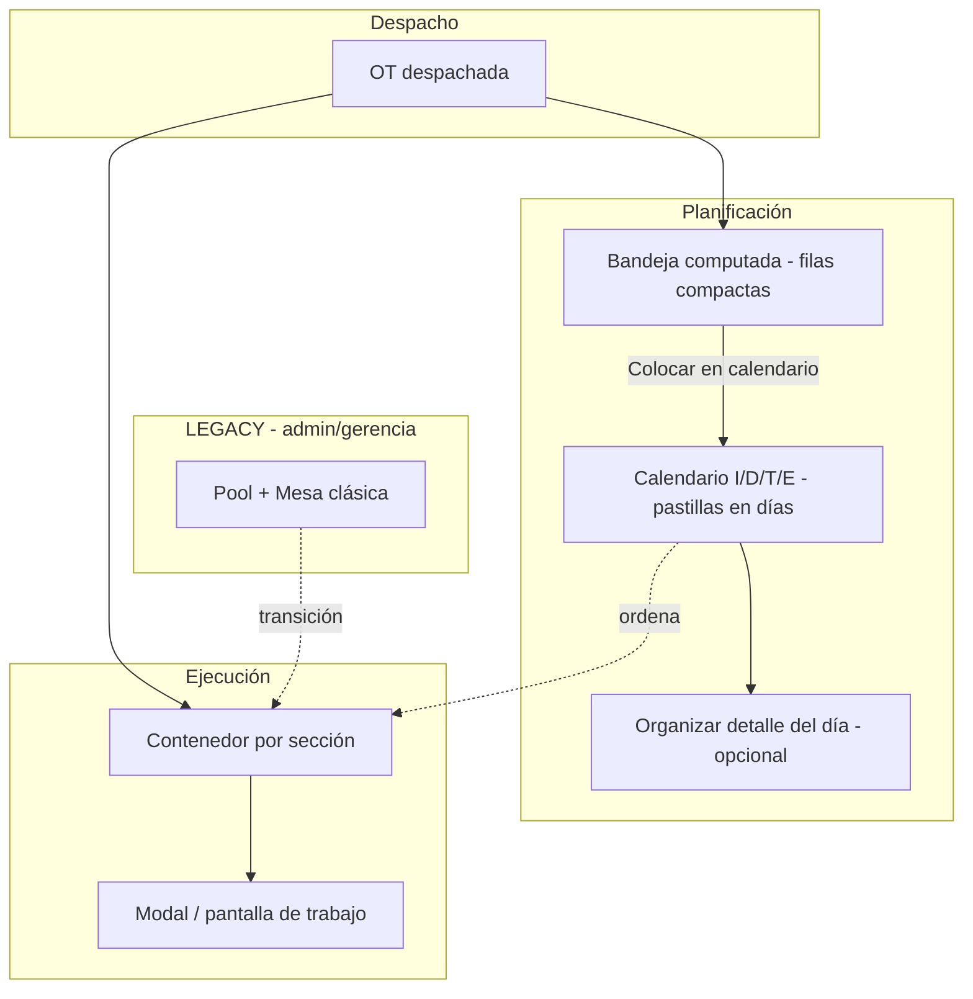

# Bloque 11 — Calendario, bandeja, contenedor y mesa (decisión de diseño)

> **Fecha:** 21 ago 2026 · **Rev. completa:** **22 ago 2026 tarde** (brainstorming Manel + Claude Opus + Cursor)
> **Estado:** diseño **cerrado** para implementación · validación planta pendiente (Jordi / Carlos)
> **Complementa:** `MINERVA_BLOQUE11_CALENDARIO_MAESTRO_LANZAMIENTO.md` · `.MANUALES/MINERVA_BLOQUE11_ANALISIS_CONTENEDOR_VS_MESA.md` · `.MANUALES/MINERVA_BLOQUE11_BRIEF_JORDI_CARLOS.md`
> **Código 22 ago tarde:** botón «Enviar a cola de Mesa» **retirado** del calendario (`calendario-produccion-page.tsx`). Motor contenedor: **pendiente**.

---

## 0. Veredicto ejecutivo

| Tema | Decisión |
|------|----------|
| **Sustituir Optimus** | Despacho ≈ launch; operario tira del **contenedor** (pull) |
| **Calendario I/D/T/E** | **Planning visual** del responsable — Carlos ya lo usa como mesa real |
| **Bandeja izquierda** | **Computada** (sin filas auto en BD al despachar); sustituye hojas Optimus / Excel |
| **Contenedor** | Lista por sección desde pasos `disponible`; **desacoplar** de `prod_mesa_ejecuciones` |
| **Mesa (repensada)** | **No ejecuta.** «Organizar detalle del día» — archivos **nuevos**; LEGACY intacto |
| **PR1 «Enviar a cola»** | **Retirado del calendario** (22 ago). Rama/lib aparcados para LEGACY |
| **Retener OT** | Excepción válida (diseño); **no construir** hasta que lo pidan |
| **Piloto contenedor** | CTP + Troquelado |
| **Piloto planning** | Bandeja + calendario con **Carlos**; detalle del día cuando quite Excel |

**Frase enseñable (Jordi/Carlos):**

> Despacho pone la OT en el circuito (como Optimus). El contenedor muestra todo lo que el itinerario deja hacer en cada sección. Carlos, Antonio y Gabri usan el calendario para ordenar el día. En offset (cuello de botella) se mantiene secuencia fina (turnos/horas) **encima** del contenedor — no la mesa LEGACY como puerta de ejecución.

*(Frase para planta alineada con el brief Jordi/Carlos — incluye matiz offset.)*

---

## 1. Evidencia de campo (no hipótesis)

Observaciones **22 ago 2026**:

- Carlos lleva **semanas** con el calendario Minerva en la **segunda pantalla**.
- Gemma (CTP) usa **listado/PDF del calendario** impreso como guía.
- Carlos planifica en Minerva y **copia a Excel** el listado del día → faena doble que bandeja + detalle del día deben eliminar.

**Implicación:** la pregunta ya no es «¿adoptarán el calendario?». Es «¿cómo quitamos Excel, Pool y mesa como puertas obligatorias?».

---

## 2. Mapa conceptual



> **§11:** este diagrama es **mapa conceptual**, no plan de trabajo secuencial.

---

## 3. Tres capas + regla de oro

| Capa | Pregunta | Fuente de verdad | Quién mueve |
|------|----------|------------------|-------------|
| **Calendario** | ¿Cuándo **quiero** que se haga? ¿Orden del día? | `prod_calendario_produccion_ot` | Carlos, Rita, Antonio, Gabri |
| **Itinerario** | ¿Qué **se puede** hacer ahora? | `prod_ot_pasos.estado` | Sistema (trigger) |
| **Contenedor** | ¿Qué ve y hace el operario? | Hoy: `prod_mesa_ejecuciones` → **destino:** pasos `disponible` | Operario |

> **El calendario ORDENA. El itinerario AUTORIZA.**

### Dos ejes independientes (Bloque 9)

| Eje | Fuente | Pregunta |
|-----|--------|----------|
| **Disponible** | `prod_ot_pasos.estado` | ¿Paso anterior hecho? |
| **Ejecutable** | Consulta viva compra/stock/cartela | ¿Hay material? |

**No** almacenar `esperando_material` en BD. UI: por defecto **solo ejecutable**; toggle «ver todo».

---

## 4. Dos tipos de proceso

### 4.1 Calendario — ámbitos I / D / T / E

| Ámbito | Responsable | Rol |
|--------|-------------|-----|
| **I** Impresión offset | Carlos (+ Jordi) | Planning principal |
| **D** Digital | Rita | Igual en su ámbito |
| **T** Troquelado | Antonio | Orden del día + previsión |
| **E** Engomado | Gabri | Orden del día + previsión |

Una OT puede tener **pastillas en varios ámbitos y fechas** (estela: I hecha día 5, T planificada día 8, E día 10). **No** auto-mover al día siguiente; queda **vencida visible**; el responsable mueve manualmente.

### 4.2 Contenedor puro — sin calendario propio

| Proceso | Notas |
|---------|--------|
| **CTP** | Orden heredado de I de Carlos o fallback entrega |
| **Guillotina** | Contenedor; Miguel tira de lista |
| **Desbroce** | Área engomado; Gabri ordena vía E / contenedor |
| **Manipulados internos** | Contenedor |
| **Externos (Ramón)** | Módulo actual; pastilla refleja «externo» mientras dure |

---

## 5. Bandeja computada (panel izquierdo)

Sustituye **hojas HR de Optimus** en la mesa de Carlos.

| Aspecto | Decisión |
|---------|----------|
| **UI** | Filas compactas (1 por OT); pastillas solo en calendario con día |
| **Toggle** | «Ocultar panel» / «Mostrar panel» (patrón IDE/Edge) |
| **Interacción** | **Sin drag** desde bandeja. «Colocar en calendario…» o flujo actual |
| **Datos** | **Query computada** — no auto-insert al despachar (`fecha` obligatoria en BD) |
| **Al colocar** | Desaparece de bandeja (para ese ámbito) |

### Filtro por defecto — cadena de **visualización**

⚠️ **No** confundir con cadena de **autorización** (§3). Solo ordena qué se ve primero. Toggle «ver todas».

| Responsable | Bandeja por defecto |
|-------------|---------------------|
| **Carlos (I)** | Despachadas con impresión, **sin pastilla I** |
| **Rita (D)** | Análogo digital |
| **Antonio (T)** | Con troquel sin pastilla T, **I colocada o hecha** |
| **Gabri (E)** | Con engomado sin pastilla E, **T colocada o hecha** |

**Overlay calendarios** (tipo Outlook): Antonio/Gabri ven I de Carlos mientras planifican T/E.

---

## 6. «Organizar detalle del día» (mesa repensada)

### 6.1 Qué muere en el camino feliz

- Mesa como **puerta** a ejecución (`launchExecution`).
- Mesa **semanal** (calendario la sustituye).
- Pool como paso obligatorio.

### 6.2 Qué es la pantalla nueva

Flujo desde calendario (día X + ámbito) → botón **«Organizar detalle del día»**:

```
┌─────────────────────────────────────────────────────┐
│ Izquierda: OTs de ESE día (del calendario)          │
│ Derecha: columnas máquina × turno (drag, horas)     │
│ Navegar día ±1 · sábado · PDF · cálculo horas       │
│ NO lanza ejecución                                  │
└─────────────────────────────────────────────────────┘
         ↓
Contenedor refleja orden (operario)
```

**Composición del día (v1):** añadir/quitar/mover OTs entre días = **calendario**. Detalle = **solo orden fino** por máquina/turno. Atajos desde detalle = fase posterior si lo piden.

**Piloto:** solo **Carlos** (offset, 1 máquina → orden 1-2-3). Si quita Excel, extender a Antonio/Gabri.

### 6.3 LEGACY vs archivos nuevos

| LEGACY (sin tocar, tab admin/gerencia) | Nuevo (implementar) |
|----------------------------------------|---------------------|
| `planificacion-pool-ots-tab-v2.tsx` | Bandeja en calendario |
| `planificacion-mesa-diaria-tab.tsx` | `planificacion-detalle-dia-tab.tsx` (nombre orientativo) |
| `planificacion-mesa-secuenciacion-tab.tsx` | No replicar semanal |
| `planificacion-pasar-a-mesa.ts` | Solo LEGACY |

**Reutilizar libs:** `planificacion-mesa-diaria.ts`, `types/planificacion-mesa.ts`, lógica horas/turnos/sábado/PDF donde aplique.

**Diferencias clave vs mesa actual:**

| Mesa LEGACY | Detalle del día |
|-------------|-----------------|
| OTs desde Pool (`enviada_mesa`) | OTs desde **calendario del día** |
| `launchExecution` obligatorio | **No ejecuta** |
| Semanal + diaria | Solo **día** (+ navegar ±1) |

Persistencia del orden por máquina: **decisión abierta** — ver §6.5. No empezar fase 3 sin cerrarla.

### 6.4 Offset (cuello de botella)

**Regla:** offset **también** entra al contenedor (mismo motor que CTP/troquel). No es excepción al `launchExecution` LEGACY en el camino feliz.

Lo específico de offset es la **secuencia fina del día** (turnos, horas, PDF) vía «Organizar detalle del día» — **encima** del contenedor, **sin** ser puerta previa a ejecutar. Criterio Drum-Buffer-Rope: más detalle de planificación donde limita el flujo; no un circuito distinto de ejecución.

| Pregunta típica planta | Respuesta |
|------------------------|-----------|
| «¿En offset no cambia nada?» | Cambia el circuito (contenedor); **no** pierde turnos/horas/PDF (detalle del día). |
| «¿Seguimos lanzando desde mesa?» | **No** en camino feliz. LEGACY solo admin/gerencia en transición. |

### 6.5 Spike persistencia detalle del día (bloqueante fase 3)

Única decisión de arquitectura **genuinamente abierta** en este documento.

**Resolver antes de picar fase 3**, no durante:

| Opción | Pros | Riesgos |
|--------|------|---------|
| Reutilizar `prod_mesa_planificacion_trabajos` con otro origen | Menos migraciones; UI mesa similar | Columnas/constraints pensadas para `launchExecution` y pool |
| Tabla/vista ligera solo «orden día + máquina» | Modelo limpio para planning sin ejecución | Trabajo de migración / doble lectura temporal |

**Entregable del spike:** diagrama origen de datos + decisión escrita + impacto en `planificacion-detalle-dia-tab.tsx`. Si se elige mal, fase 3 puede obligar a rehacer a medio construir.

---

## 7. Contenedor y ejecución

### Trabajo de verdad (motor)

| ✅ Ya funciona | ❌ Falta |
|---------------|---------|
| Primer paso `disponible` al despachar | Lista operario **sin** mesa obligatoria |
| Trigger avanza itinerario | Claim = **iniciar** |
| `ExecutionCard`, cartelas, gates 9 | Gate material por **proceso** |

### UI ejecución

- Lista fina; **modal grande** o pantalla completa al abrir OT.
- **Orden arreglos:** filtro + orden **antes** que modal.

---

## 8. PR1 — retirada del calendario

| Pieza | Estado |
|-------|--------|
| Label paso, espejo lectura, semáforos, PDF | ✅ Mantener |
| Botón «Enviar a cola de Mesa» | ❌ **Retirado** (22 ago tarde) |
| `planificacion-pasar-a-mesa.ts` | LEGACY / rama feature |
| Rama `feature/bloque11-calendario-enviar-cola-mesa` | Sin merge como arquitectura |

---

## 9. Retener (futuro)

Toggle «Retener / no lanzar aún»: OT despachada excluida del contenedor hasta liberación. **No construir** hasta demanda.

---

## 10. LEGACY

Pestaña **Planificación clásica (Pool / Mesa)** — solo **admin / gerencia** durante transición.

---

## 11. Orden conceptual ≠ orden de construcción

El diagrama §2 **no** implica terminar contenedor antes de bandeja.

| Track A — Motor | Track B — Planning UI |
|-----------------|----------------------|
| Contenedor + ejecución sin mesa | Bandeja + toggle panel |
| Claim al iniciar | Overlay calendarios |
| Filtro ejecutable | Detalle del día (Carlos) |
| Piloto CTP + Troquel | Quitar Excel |

La bandeja **no depende** del contenedor; solo de despacho + itinerario (operativos).

---

## 12. Fases

| Fase | Entregable |
|------|------------|
| **0** | Validar brief Jordi/Carlos |
| **1a** | Contenedor + modal ejecución (CTP + T) |
| **1b** | Bandeja computada + ocultar panel (Carlos) |
| **2** | Filtros cadena bandeja + overlay |
| **2b** | **Spike persistencia detalle del día** (§6.5 — **antes** de fase 3) |
| **3** | Detalle del día — Carlos (solo tras spike 2b) |
| **4** | Offset secuencia fina (refinar detalle si hace falta) |
| **5** | LEGACY tab |

---

## 13. Decisiones cerradas

| # | Decisión |
|---|----------|
| 13.1 | Calendario ordena; itinerario autoriza |
| 13.2 | Bandeja **computada** |
| 13.3 | Filtro cadena = **visualización** |
| 13.4 | CTP/guillotina/desbroce/manipulados = contenedor |
| 13.5 | Solo I/D/T/E en calendario |
| 13.6 | Mesa nueva **no ejecuta**; archivos nuevos; LEGACY intacto |
| 13.7 | Composición día v1 = calendario; detalle = orden fino |
| 13.8 | Claim = iniciar |
| 13.9 | No auto-mover vencidas |
| 13.10 | PR1 botón fuera calendario |
| 13.11 | Retener = diseño, no build |
| 13.12 | Gate por proceso = pendiente |
| 13.13 | Persistencia detalle del día = **pendiente spike 2b** (bloqueante fase 3) |

---

## 14. Checklist

- [x] Documentar modelo completo
- [x] Retirar botón «Enviar a cola» del calendario
- [ ] Validar brief Jordi/Carlos
- [ ] Spike bandeja computada
- [x] **Spike contenedor CTP** (`feature/bloque11-contenedor-ctp-spike`) — ver §17
- [ ] **Spike persistencia detalle del día (§6.5) — obligatorio antes de fase 3**
- [ ] Ejecución modal
- [ ] Detalle del día (Carlos) — **solo tras spike persistencia**
- [ ] LEGACY tab
- [x] Spike troquel + claim (`contenedor-troquel.ts` · ver §18)
- [x] Spike contenedores Guillotina/Desbroce/Manipulados + Engomado claim (`contenedor-seccion.ts` · ver §19)

---

## 15. Referencias código

| Pieza | Archivo | Notas |
|-------|---------|-------|
| Itinerario | `prod-ot-itinerario-client.ts` | Paso 1 disponible |
| Calendario | `calendario-produccion-page.tsx` | Sin botón cola |
| Espejo | `calendario-mesa-espejo.ts` | Lectura |
| Pasar a mesa | `planificacion-pasar-a-mesa.ts` | LEGACY |
| Mesa diaria LEGACY | `planificacion-mesa-diaria-tab.tsx` | No modificar camino feliz |
| Detalle día (futuro) | `planificacion-detalle-dia-tab.tsx` | Por crear |
| Helpers mesa | `planificacion-mesa-diaria.ts` | Reutilizar |
| Ejecución | `planificacion-ots-ejecucion-tab.tsx` | + contenedor CTP spike |
| Contenedor CTP | `contenedor-ctp.ts` | Query + fila ligera |

---

## 16. Resumen una página

1. Carlos **ya usa** el calendario — reforzarlo.
2. **Bandeja computada** quita hojas Optimus y Excel (con detalle del día).
3. **Contenedor** sustituye Pool/Mesa como puerta.
4. **CTP/guillotina/desbroce/manipulados** = contenedor; **I/D/T/E** = calendario.
5. **Detalle del día** = mesa nueva en **archivos nuevos**, no ejecuta; LEGACY vive en `.tsx` actuales.
6. **Construcción en paralelo:** motor + UI planning.
7. **PR1 botón eliminado** del calendario.

---

## 17. Spike CTP — resultado (22 ago 2026 noche)

**Rama:** `feature/bloque11-contenedor-ctp-spike`

### Qué se hizo
- Lista de ejecución mezcla filas reales + **virtuales** del contenedor CTP (pasos `disponible`, OT despachada, sin ejecución activa en ese `ot_paso_id`).
- Badge «Contenedor CTP»; toggles **Mostrar OTs prueba** (off por defecto) y **Solo ejecutable**.
- Al **Iniciar**: `crearEjecucionLigeraCtp` → INSERT `pendiente_inicio` con `mesa_trabajo_id = null` + UPDATE `en_curso` (para disparar triggers de itinerario).
- Calendario Carlos **no tocado**.

### Sorpresas / fricción al desacoplar `prod_mesa_ejecuciones`

| Hallazgo | Impacto |
|----------|---------|
| `maquina_id` es **NOT NULL** | Fila «ligera» exige máquina CTP (`tipo_maquina = preimpresion`, hoy «CTP MNRV»). No se puede omitir. |
| `mesa_trabajo_id` **nullable** | OK — no hace falta hueco de mesa. |
| Unique parcial `(ot_numero, maquina_id)` en estados activos | Deduplicar por paso ocupado **y** no crear segunda activa misma OT+máquina. |
| Triggers itinerario son **AFTER UPDATE**, no INSERT | Insertar directo como `en_curso` **no** pondría el paso en marcha. Solución: INSERT `pendiente_inicio` → UPDATE `en_curso`. |
| CTP no consume papel | «Ejecutable» = siempre true si `disponible`; el toggle queda listo para otras secciones. |

### Smoke manual recomendado
1. Activar «Mostrar OTs prueba» → debe verse p.ej. **98005** (CTP disponible) con badge Contenedor CTP.
2. Desactivar el toggle → 98005 **desaparece** de la lista planta.
3. Con pruebas ON: abrir → Iniciar → debe nacer fila real sin mesa; cerrar paso → itinerario avanza.
4. LEGACY Pool/Mesa: sin cambios.

### Siguiente
~~Troquelado + claim al iniciar (mismo patrón, multi-máquina).~~ → ver §18

---

## 18. Spike Troquel + claim — resultado (22 ago 2026 noche)

**Rama:** `feature/bloque11-contenedor-ctp-spike` (mismo spike CTP + Troquel)

### Qué se hizo
- Lista de ejecución mezcla filas reales + **virtuales Contenedor Troquel** (pasos `disponible`, OT despachada, sin ejecución activa en ese `ot_paso_id`).
- Badge «Contenedor Troquel»; máquina placeholder hasta claim.
- **Claim = Iniciar:** selector de máquinas `tipo_maquina = troquelado` (JR, …). Al iniciar → `crearEjecucionLigeraTroquel` (mesa null + UPDATE `en_curso`).
- Filtro por máquina troquel: filas virtuales siguen visibles (el claim preselecciona esa máquina).
- «Devolver al Pool» oculto en filas virtuales contenedor (CTP y Troquel).
- Calendario Carlos **no tocado**.

### Smoke manual recomendado
1. Activar «Mostrar OTs prueba» → buscar OT con Troquel `disponible` (p.ej. **98010-02**) → badge **Contenedor Troquel** y texto *elegir al iniciar*.
2. Abrir parte → caja ámbar **«Elige troqueladora (claim)»** (sin default ASPAS). Elegir JR → **Iniciar**.
3. Si claimas mal: **Anular (volver a Contenedor)** (no «Devolver al Pool» — eso exige mesa).
4. Cerrar proceso Troquel → itinerario avanza.
5. LEGACY Pool/Mesa: sin cambios.

### Lab 22 ago — 98010-02
- Offset finalizada OK; claim accidental ASPAS; «Devolver al Pool» fallaba sin mesa.
- BD: ejecución ASPAS cancelada → Troquel `disponible` otra vez (estado post-impresión).
- UX fix: claim obligatorio + visible; anular ejecución ligera.

### Siguiente
~~Contenedor Impresión~~ → tras validar §19 (Desbroce/Guillotina/Manipulados/Engomado).

---

## 19. Spike contenedores G/D/M + Engomado (22 ago 2026 noche)

**Rama:** `feature/bloque11-contenedor-ctp-spike`

### Qué se hizo
- Módulo genérico `contenedor-seccion.ts`: Guillotina, Desbroce, Manipulados, Engomado.
- **Guillotina / Desbroce / Manipulados MNRV:** 1 máquina (como CTP). Manipulados = nombre exacto `Manipulados MNRV` (tipo BD `engomado`).
- **Engomado:** claim multi-máquina (engomadora 65/110, KONIKA; excluye Manipulados).
- Badges violeta; Anular ligera sigue valiendo.

### Smoke
1. **98010-02** → Contenedor Desbroce → Iniciar → cerrar → Engomado `disponible`.
2. Engomado → claim engomadora → Iniciar.
3. Guillotina / Manipulados si hay pasos `disponible` en lab.

### Siguiente
Contenedor Impresión (SpeedMaster) tras cena / validación.

---

*Manel + Claude Opus + Cursor · 21–22 ago 2026 · CTP · Troquel · G/D/M/E*